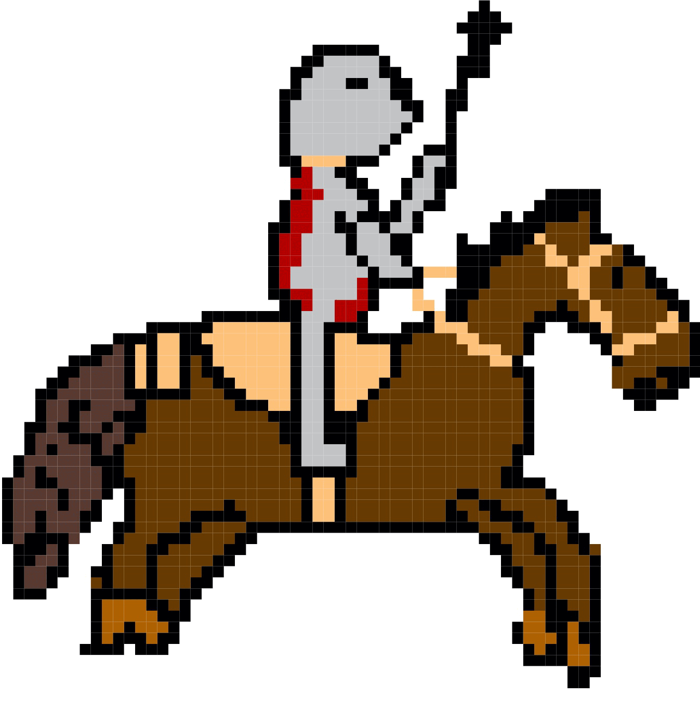

# Tudor Wars

By Beau Lewis

# Background

The tudors had lots of wars ... 

## The Battle of The Spurs

The battle of the Spurs is a battle between England and France. It took place on 16 August 1513. The English were led by king Henry the eighth and the French by Pierre terrail. Henry’s armies consisted of about 1,100 horseback and 11,000 foot soldiers whereas Pierre’s had around 8,000 horseback and an unknown amount of foot soldiers. A famous picture is included by Georg Lemberger. The battle was eventually won by Henry and his army.

## Characters in the game level

| Name          | Game Avatar           | Original  | Notes |
| ------------- |:---------------------:|:---------:|:----- |
| Henry VIII (Tudor) | |  | Henry was King of England |
| Pierre Terrail |  || Pierre Terrail, seigneur de Bayard, one of the French commanders in the battle |
| English cavalry |  |  |Henry had 1,100 cavalry. Horse picture is inspiration for Beau's cavalry avatar|
| French cavalry |  |  |The number of French cavalry is unknown|
| English Arrow |  || The English had archers among their infantry |
| French Lance |  || The French cavalry had lances they charged with|
| Background |  |  |The painting of the battle by Georg Lemberger. It is faded here to make a backgroubnd for the game|

