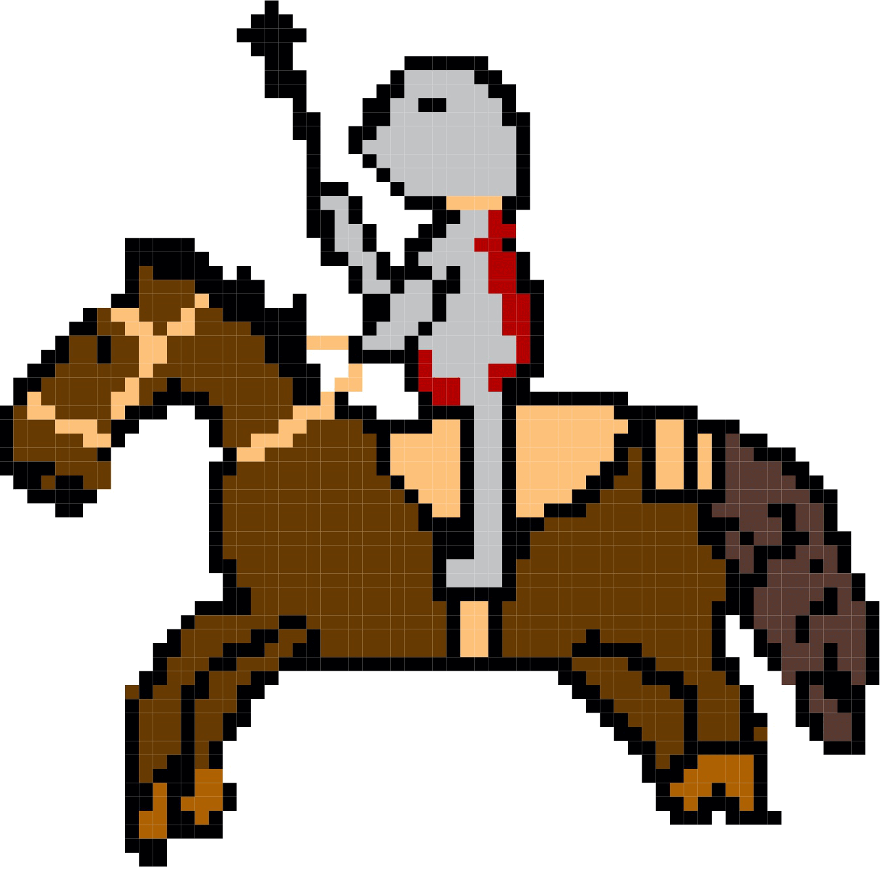

<!DOCTYPE html>
<html>
<head>
<title>The Tudors</title>
<meta charset="utf-8" />
<meta http-equiv="Content-Type" content="text/html;charset=utf-8" />
<meta http-equiv="Content-Style-Type" content="text/css" />
<meta http-equiv="Content-Script-Type" content="text/javascript" />
<meta http-equiv="X-UA-Compatible" content="IE=edge,chrome=1" />
<meta name="viewport" content="width=device-width, initial-scale=1, maximum-scale=1" />

</head>

<body>

<h1>Tudor Wars</h1>

By Beau Lewis

<h2>Background</h2>

The tudors had lots of wars ... 

<h3>The Battle of The Spurs</h3>

The battle of the Spurs is a battle between England and France. It took place on 16 August 1513. The English were led by king Henry the eighth and the French by Pierre terrail. Henry’s armies consisted of about 1,100 horseback and 11,000 foot soldiers whereas Pierre’s had around 8,000 horseback and an unknown amount of foot soldiers. A famous picture is included by Georg Lemberger. The battle was eventually won by Henry and his army.

<h3>Characters in the game</h3>

<h4>Henry VIII (Tudor)</h4>

  
  

Henry in a painting and by Beau 

<h4>Pierre Terrail</h4>

Pierre in a painting and by Beau

<h4>English cavalry</h4>

  
  
</a>

Horse inspiration and cavalry by Beau 

 

<h3>The Spanish Armada</h3>

The Pursuit to Calais, Fri 5th August – Sat 6th August <a title="Armada" href="https://www.nmrn.org.uk/major-appeals/armada-maps/view-armada-maps">Museum maps</a>

The Spanish Armada was a fleet of 130 ships that were sent to invade England in late may 1588 by king Phillip the second. This resulted in a battle from May until August 1588. Francis drake was playing a game of bowls when the Spanish invaded and waited until he was finished to attack back. England had 34 warships and 163 armed merchant vessels whereas the Spanish had 108 armed merchant vessels, 2,431 cannons, 7,000 sailors and 17,000 soldiers.(the English also had 30 flyboats as they had teamed up with the Dutches. This eventually ended in an English victory.

Sir Francis Drake finishes his game of bowls on Plymouth Hoe as the Spanish Armada is sighted, by <a title="Peter Jackson" href="https://www.lookandlearn.com/history-images/search.php?search=Peter+Jackson&amp;bool=phrase">Peter Jackson</a>

</body>
