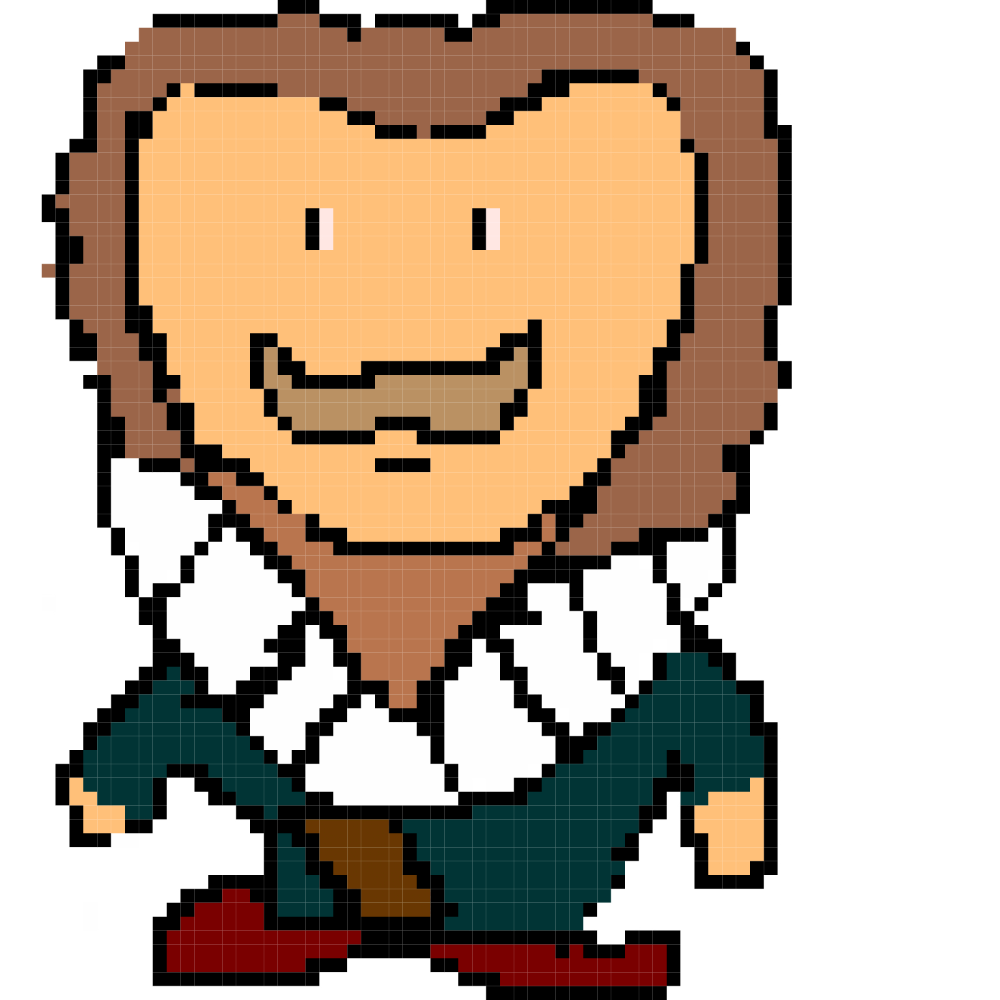
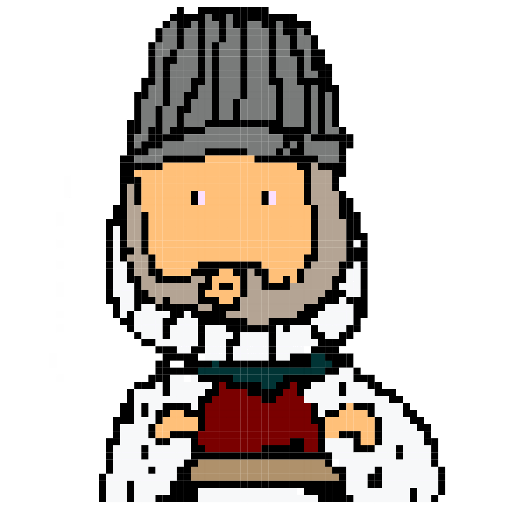
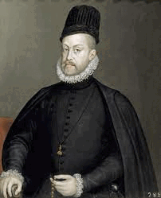
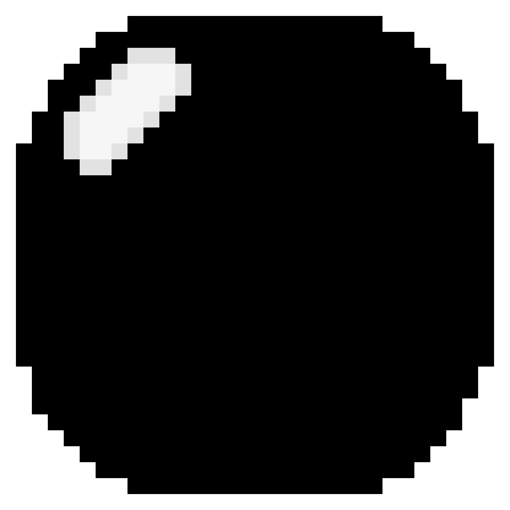
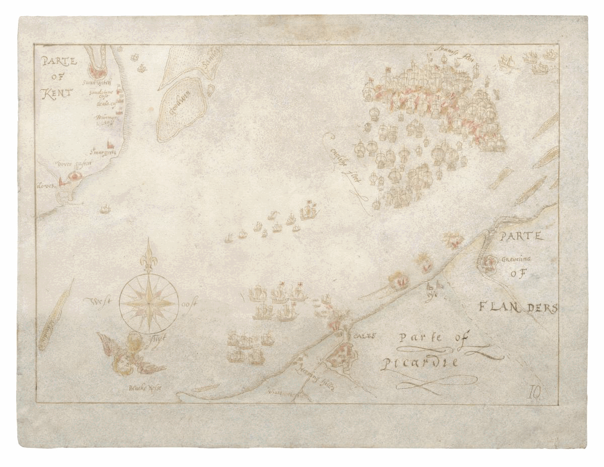

# The Spanish Armada

The Spanish Armada was a fleet of 130 ships that were sent to invade England in late may 1588 by king Philip the second. This resulted in a battle from May until August 1588. Francis drake was playing a game of bowls when the Spanish invaded and waited until he was finished to attack back. England had 34 warships and 163 armed merchant vessels whereas the Spanish had 108 armed merchant vessels, 2,431 cannons, 7,000 sailors and 17,000 soldiers.(the English also had 30 flyboats as they had teamed up with the Dutches. This eventually ended in an English victory.

## Characters in the game level

| Name          | Game Avatar           | Original  | Notes |
| ------------- |:---------------------:|:---------:|:----- |
| Francis Drake |  |  | He was the commander of the english under the rule of queen Elizabeth the first, who was one of king Henry's daughters. |
|Philip II of Spain|  | | Philip II was King of Spain. He sent hisd admirals and soldiers to invade England in the Armada. |
| Bowls ball |  |  Sir Francis Drake finishes his game of bowls on Plymouth Hoe as the Spanish Armada is sighted, by [Peter Jackson](https://www.lookandlearn.com/history-images/search.php?search=Peter+Jackson&amp;bool=phrase) | Francis Drake famously played a game of bowls as the Spanish armada sailed into England and would not fight until he finished. | 
| Cannon shot |  |  | The Tudor period cannons fire round shot from the side of ships |
|Background |  |  | This map from the Battle of Gravelines, Mon 8th August.The Battle of Gravelines, Mon 8th August Map from [NMRN](https://www.nmrn.org.uk/major-appeals/armada-maps).|

