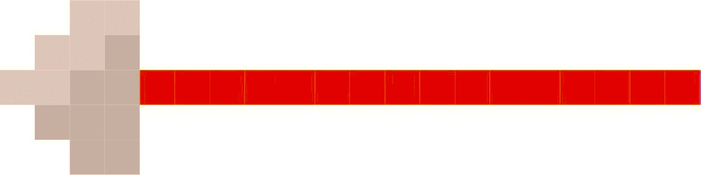
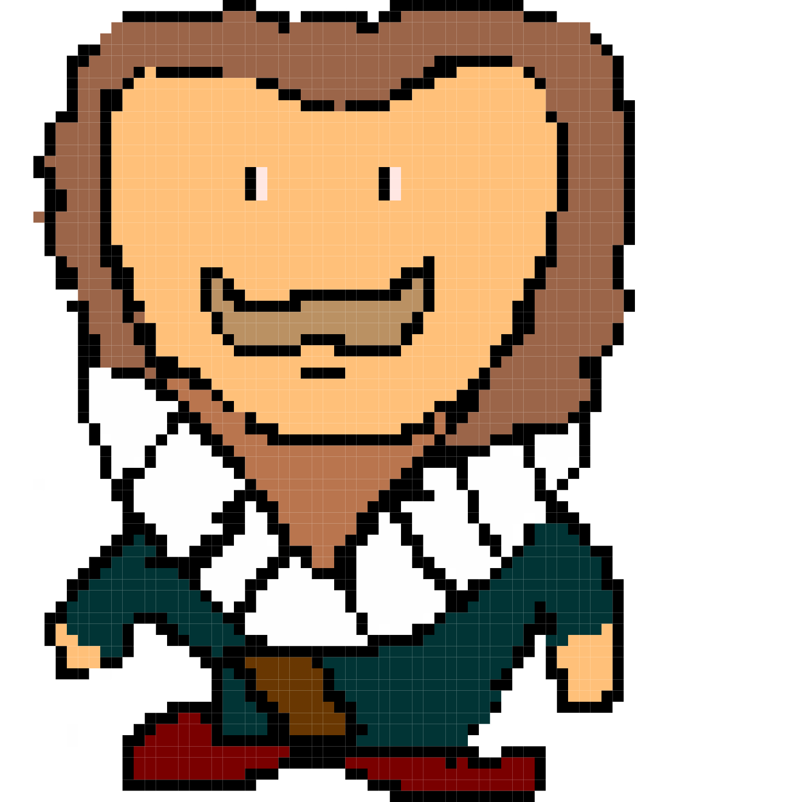
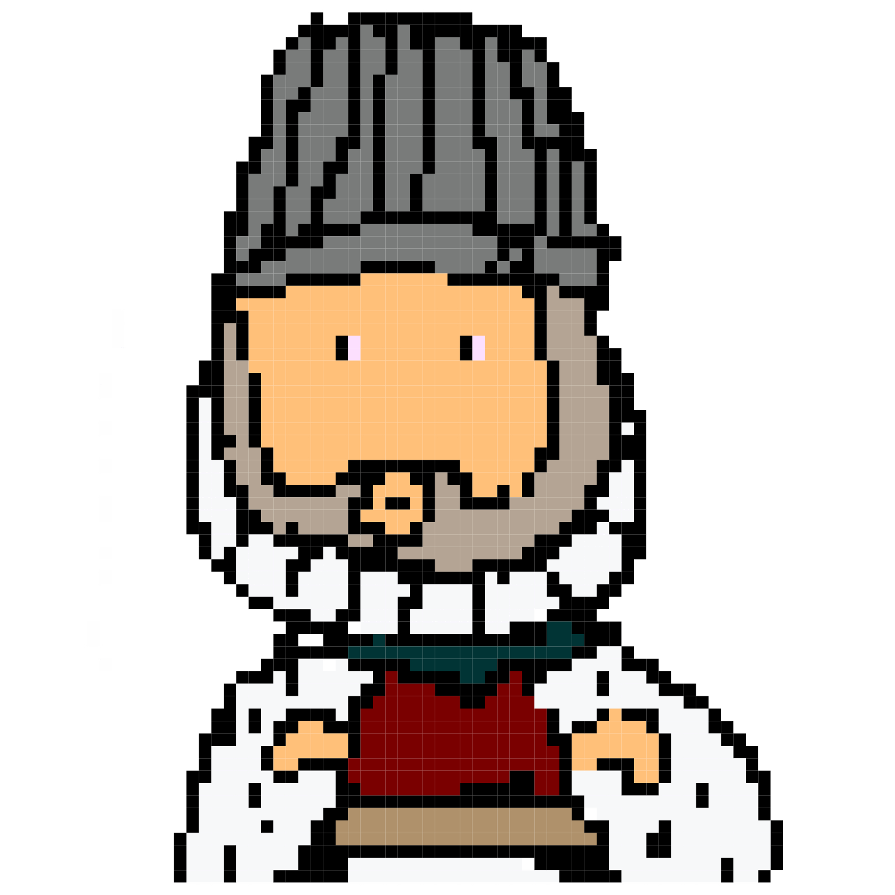
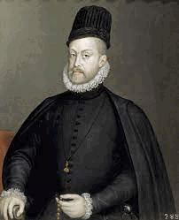
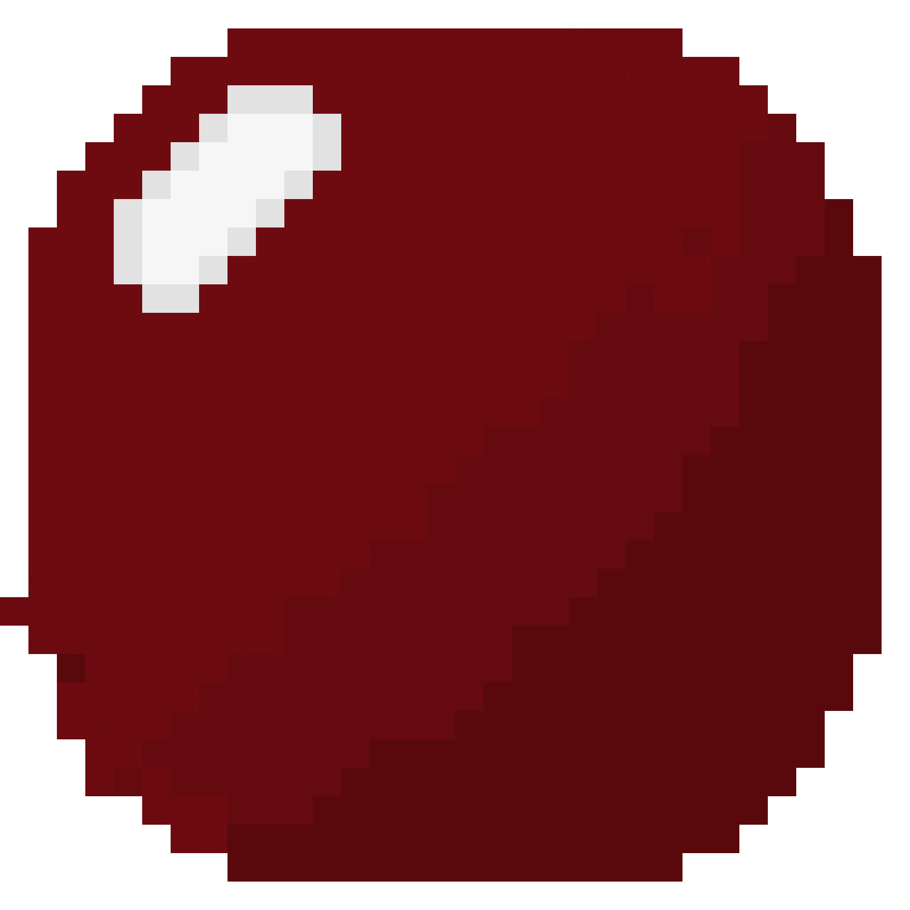

# Tudor Wars

By Beau Lewis

# Background

The tudors had lots of wars ... 

## The Battle of The Spurs

The battle of the Spurs is a battle between England and France. It took place on 16 August 1513. The English were led by king Henry the eighth and the French by Pierre terrail. Henry’s armies consisted of about 1,100 horseback and 11,000 foot soldiers whereas Pierre’s had around 8,000 horseback and an unknown amount of foot soldiers. A famous picture is included by Georg Lemberger. The battle was eventually won by Henry and his army.

## Characters in the game level

| Name          | Game Avatar           | Original  | Notes |
| ------------- |:---------------------:|:---------:|:----- |
| Henry VIII (Tudor) | |  | Henry was King of England |
| Pierre Terrail |  || Pierre Terrail, seigneur de Bayard, one of the French commanders in the battle |
| English cavalry |  |  |Henry had 1,100 cavalry. Horse picture is inspiration for Beau's cavalry avatar|
| French cavalry |  |  |The number of French cavalry is unknown|
| English Arrow |  || The English had archers among their infantry |
| French Lance |  || The French cavalry had lances they charged with|
| Background |  |  |The painting of the battle by Georg Lemberger. It is faded here to make a backgroubnd for the game|

## The Spanish Armada

The Spanish Armada was a fleet of 130 ships that were sent to invade England in late may 1588 by king Phillip the second. This resulted in a battle from May until August 1588. Francis drake was playing a game of bowls when the Spanish invaded and waited until he was finished to attack back. England had 34 warships and 163 armed merchant vessels whereas the Spanish had 108 armed merchant vessels, 2,431 cannons, 7,000 sailors and 17,000 soldiers.(the English also had 30 flyboats as they had teamed up with the Dutches. This eventually ended in an English victory.

## Characters in the game level

| Name          | Game Avatar           | Original  | Notes |
| ------------- |:---------------------:|:---------:|:----- |
| Francis Drake |  |  | He was not a duck |
|Philip II of Spain|  | | Philip II was King of Spain. He sent hisd admirals and soldiers to invade England in the Armada. |
| Bowls ball |  |  Sir Francis Drake finishes his game of bowls on Plymouth Hoe as the Spanish Armada is sighted, by [Peter Jackson](https://www.lookandlearn.com/history-images/search.php?search=Peter+Jackson&amp;bool=phrase) | Drake fampously did something | 
| Cannon shot |  |  | The Tudor period cannons fire round shot from the side of ships |
|Background |  |  | This map from the Battle of Gravelines, Mon 8th August.The Battle of Gravelines, Mon 8th August Map from [NMRN](https://www.nmrn.org.uk/major-appeals/armada-maps).|

