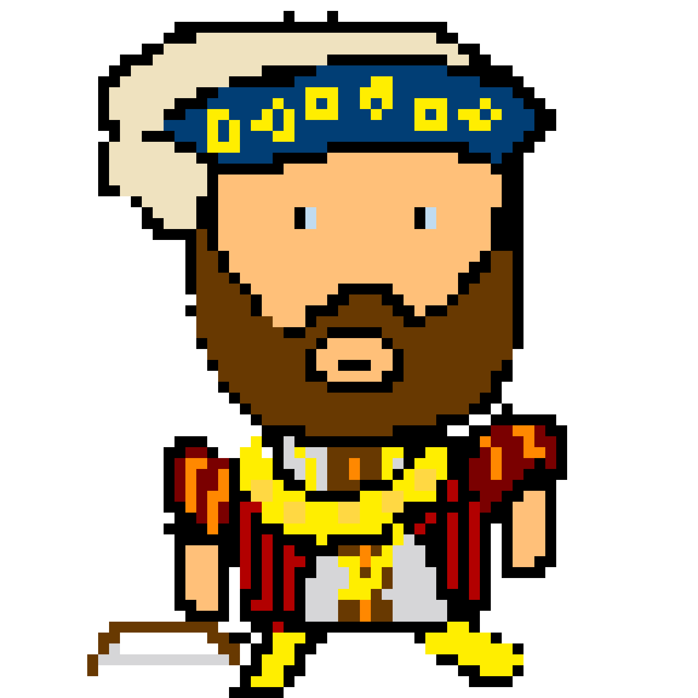
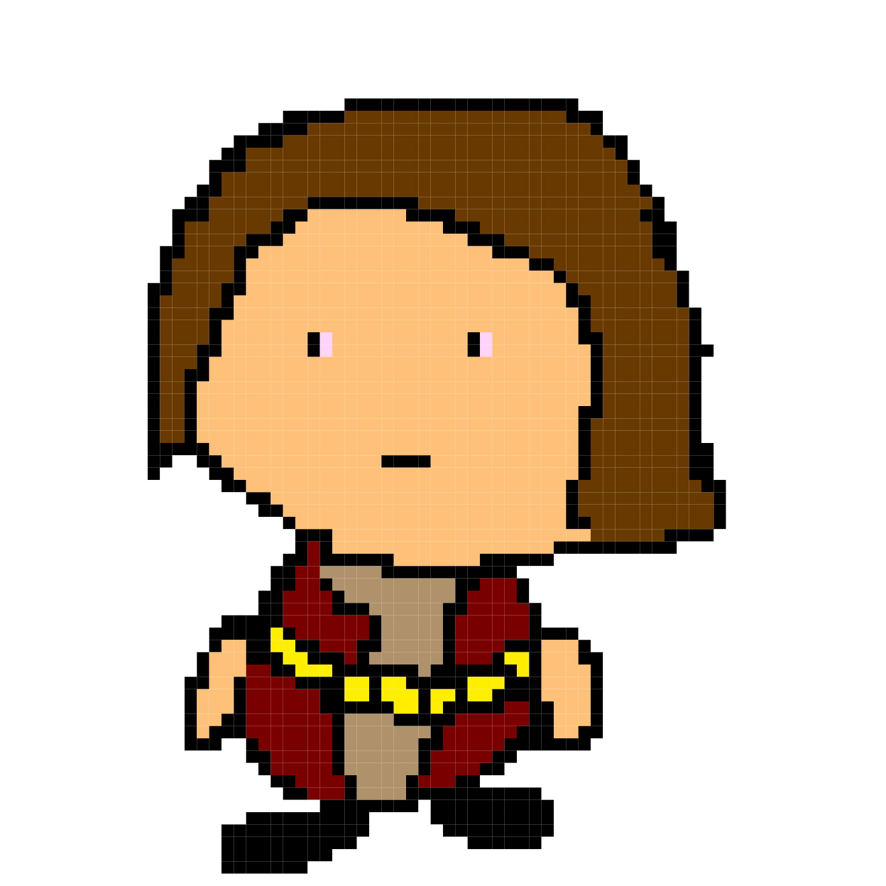
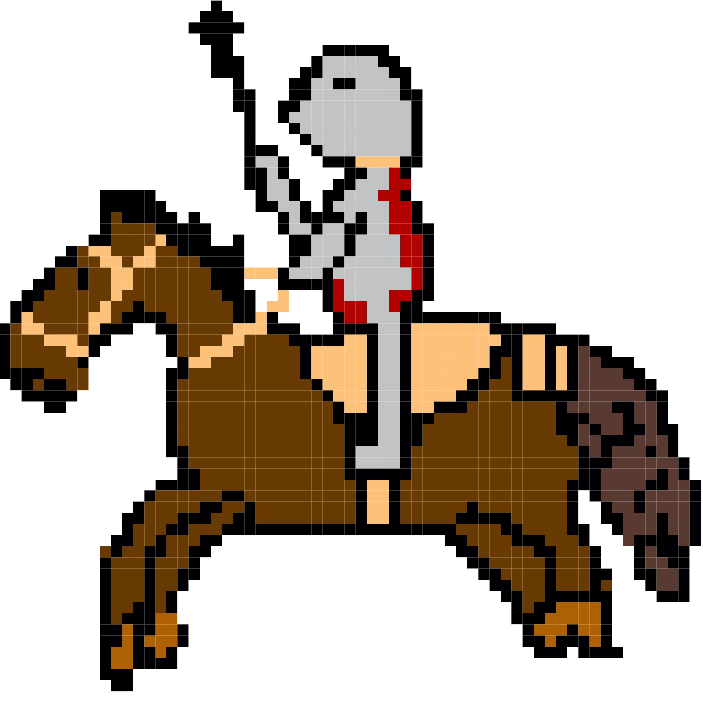
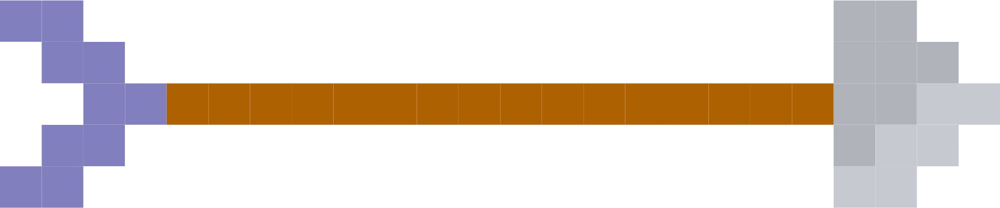
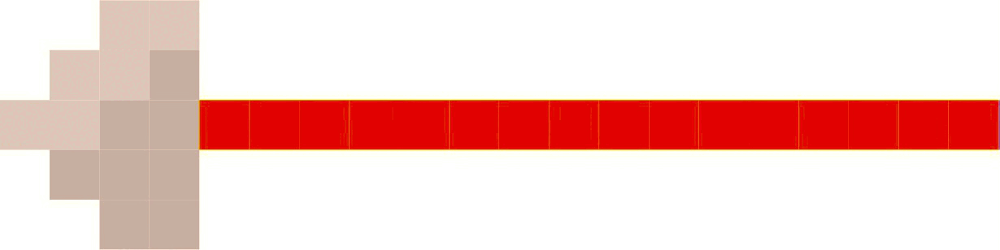
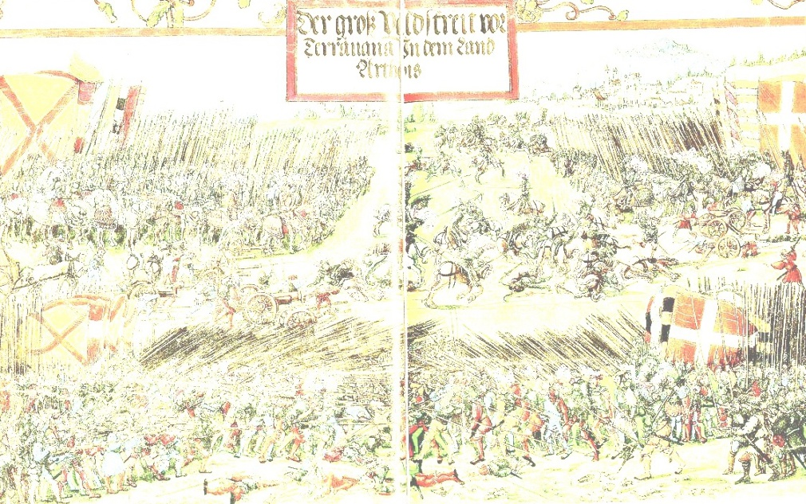

The Battle of The Spurs
=======================

The battle of the Spurs is a battle between England and France. It took
place on 16 August 1513. The English were led by king Henry the eighth
and the French by Pierre terrail. Henry’s armies consisted of about
1,100 horseback and 11,000 foot soldiers whereas Pierre’s had around
8,000 horseback and an unknown amount of foot soldiers. A famous picture
is included by Georg Lemberger. The battle was eventually won by Henry
and his army.

Characters in the game level
----------------------------

+----------------+------------------------------+-------------+-------+
| Name           | Game Avatar                  | Original    | Notes |
+================+==============================+=============+=======+
| Henry VIII     | |Beau’s Henry VIII Avatar|   | |Henry      | King  |
| (Tudor)        |                              | VIII|       | Henry |
|                |                              |             | led   |
|                |                              |             | his   |
|                |                              |             | army  |
|                |                              |             | into  |
|                |                              |             | b     |
|                |                              |             | attle |
|                |                              |             | and   |
|                |                              |             | was   |
|                |                              |             | ma    |
|                |                              |             | rried |
|                |                              |             | 6     |
|                |                              |             | t     |
|                |                              |             | imes, |
|                |                              |             | to    |
|                |                              |             | Cath  |
|                |                              |             | erine |
|                |                              |             | Parr  |
|                |                              |             | Cath  |
|                |                              |             | erine |
|                |                              |             | Ho    |
|                |                              |             | ward, |
|                |                              |             | Anne  |
|                |                              |             | of    |
|                |                              |             | Cl    |
|                |                              |             | eves, |
|                |                              |             | Jane  |
|                |                              |             | Sey   |
|                |                              |             | mour, |
|                |                              |             | Anne  |
|                |                              |             | B     |
|                |                              |             | oleyn |
|                |                              |             | and   |
|                |                              |             | Cath  |
|                |                              |             | erine |
|                |                              |             | of    |
|                |                              |             | Ar    |
|                |                              |             | agon. |
+----------------+------------------------------+-------------+-------+
| Pierre Terrail | |Beau’s Pierre Terrail       | |Pierre     | P     |
|                | Avatar|                      | Terrail,    | ierre |
|                |                              | seigneur de | Ter   |
|                |                              | Bayard|     | rail, |
|                |                              |             | sei   |
|                |                              |             | gneur |
|                |                              |             | de    |
|                |                              |             | Ba    |
|                |                              |             | yard, |
|                |                              |             | one   |
|                |                              |             | of    |
|                |                              |             | the   |
|                |                              |             | F     |
|                |                              |             | rench |
|                |                              |             | comma |
|                |                              |             | nders |
|                |                              |             | in    |
|                |                              |             | the   |
|                |                              |             | b     |
|                |                              |             | attle |
+----------------+------------------------------+-------------+-------+
| English        | |English cavalry avatar|     | |Horse      | Henry |
| cavalry        |                              | picture|    | had   |
|                |                              |             | 1,100 |
|                |                              |             | cav   |
|                |                              |             | alry. |
|                |                              |             | Horse |
|                |                              |             | pi    |
|                |                              |             | cture |
|                |                              |             | is    |
|                |                              |             | i     |
|                |                              |             | nspir |
|                |                              |             | ation |
|                |                              |             | for   |
|                |                              |             | B     |
|                |                              |             | eau’s |
|                |                              |             | ca    |
|                |                              |             | valry |
|                |                              |             | a     |
|                |                              |             | vatar |
+----------------+------------------------------+-------------+-------+
| French cavalry | |Spanish cavalry avatar|     | |Horse      | The   |
|                |                              | picture|    | n     |
|                |                              |             | umber |
|                |                              |             | of    |
|                |                              |             | F     |
|                |                              |             | rench |
|                |                              |             | ca    |
|                |                              |             | valry |
|                |                              |             | is    |
|                |                              |             | un    |
|                |                              |             | known |
+----------------+------------------------------+-------------+-------+
| English Arrow  | |English arrow avatar|       |             | The   |
|                |                              |             | En    |
|                |                              |             | glish |
|                |                              |             | had   |
|                |                              |             | ar    |
|                |                              |             | chers |
|                |                              |             | among |
|                |                              |             | their |
|                |                              |             | 1     |
|                |                              |             | 1,000 |
|                |                              |             | infa  |
|                |                              |             | ntry. |
+----------------+------------------------------+-------------+-------+
| French Lance   | |French lance avatar|        |             | The   |
|                |                              |             | F     |
|                |                              |             | rench |
|                |                              |             | ca    |
|                |                              |             | valry |
|                |                              |             | had   |
|                |                              |             | l     |
|                |                              |             | ances |
|                |                              |             | that  |
|                |                              |             | they  |
|                |                              |             | used  |
|                |                              |             | in    |
|                |                              |             | b     |
|                |                              |             | attle |
|                |                              |             | for   |
|                |                              |             | r     |
|                |                              |             | anged |
|                |                              |             | and   |
|                |                              |             | close |
|                |                              |             | co    |
|                |                              |             | mbat. |
+----------------+------------------------------+-------------+-------+
| Background     | |Georg Lemberger painting    | |Original   | The   |
|                | used as background|          | painting|   | pai   |
|                |                              |             | nting |
|                |                              |             | of    |
|                |                              |             | the   |
|                |                              |             | b     |
|                |                              |             | attle |
|                |                              |             | by    |
|                |                              |             | Georg |
|                |                              |             | Lembe |
|                |                              |             | rger. |
|                |                              |             | It is |
|                |                              |             | faded |
|                |                              |             | here  |
|                |                              |             | to    |
|                |                              |             | make  |
|                |                              |             | a     |
|                |                              |             | b     |
|                |                              |             | ackgr |
|                |                              |             | oubnd |
|                |                              |             | for   |
|                |                              |             | the   |
|                |                              |             | game  |
+----------------+------------------------------+-------------+-------+

.. |Henry VIII| image:: http://www.luminarium.org/renlit/henry81540c.jpg
   :target: http://www.luminarium.org/renlit/tudor.htm

.. |Pierre Terrail, seigneur de Bayard| image:: https://upload.wikimedia.org/wikipedia/commons/5/59/Pierre_Terrail_de_Bayard.jpg
   :target: https://en.wikipedia.org/wiki/Pierre_Terrail,_seigneur_de_Bayard

.. |Horse picture| image:: https://thumbs.dreamstime.com/z/bay-stallion-free-run-fast-desert-dust-horse-galloping-sand-184357183.jpg
   :target: https://www.dreamstime.com/bay-stallion-free-run-fast-desert-dust-horse-galloping-sand-image184357183

.. |Original painting| image:: https://upload.wikimedia.org/wikipedia/commons/f/f5/Georg_Lemberger%2C_Battle_of_Guinegate_%281513%29%2C_Triumphzug_Kaiser_Maximilians.jpg
   :target: https://en.wikipedia.org/wiki/Battle_of_the_Spurs
